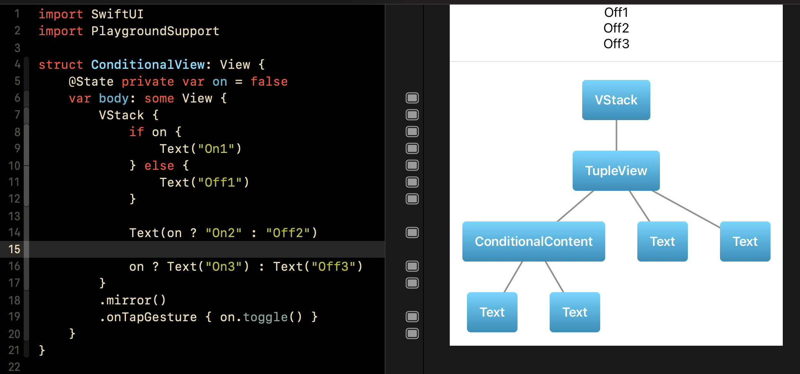

# Introspection

SmallPlanet.com iOS Journal Club topic Thu Jul 29, 2021

Based on https://www.hackingwithswift.com/books/ios-swiftui/why-does-swiftui-use-some-view-for-its-view-type

Strongly leveraging the amazing code at this gist: https://gist.github.com/chriseidhof/d23f82f8a9e85e75bc02be220326199a

## Usage

This is a multi-page playground for Xcode 12+ that demonstrates the SwiftUI type system in gory detail. Running a page will render the SwiftUI view in that page, print its Mirror description in the console, and render that introspection as a tree under the View. The View can be edited live to investigate what happens when you change view modifiers and their order, or interesting things like changing a ForEach to a List.

